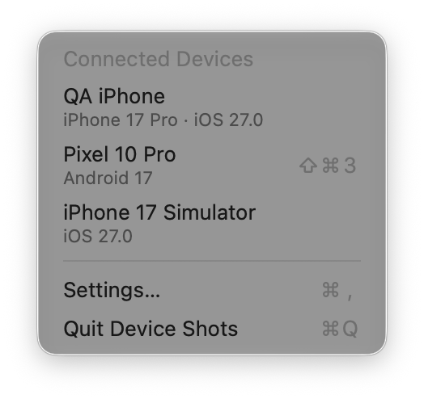
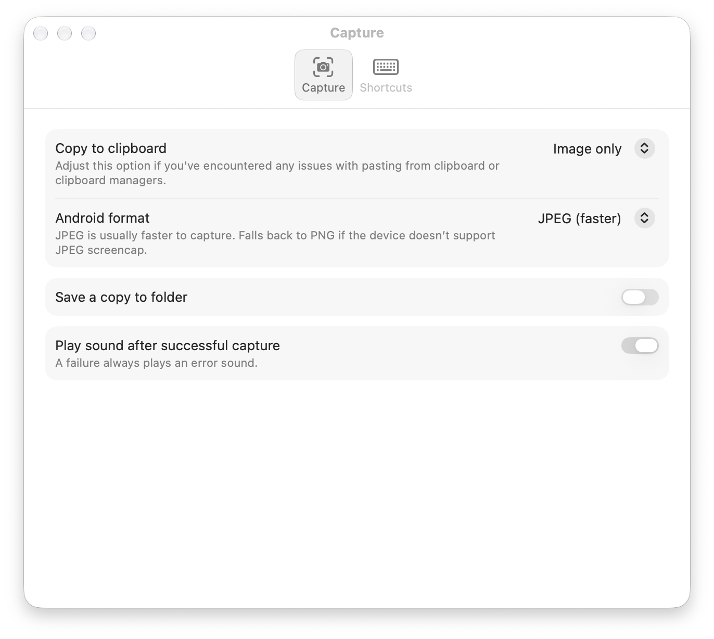
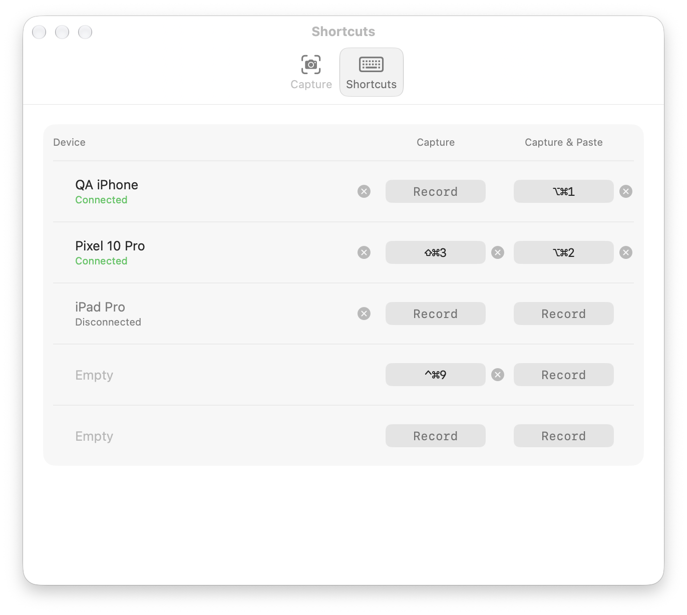

# Device Shots

A tiny macOS menu-bar app that captures screenshots from connected iOS and
Android devices straight to the clipboard. No streaming, no windows... just a
camera icon in the menu bar.

Great for pasting UI screenshots in Figma for QA, or referencing screenshots and sharing them in chats. 
Much faster than native screenshot flows.

| Device menu | Capture settings | Device shortcuts |
|:---:|:---:|:---:|
|  |  |  |

## Install

Download the latest `DeviceShots-vX.Y.zip` from
[Releases](https://github.com/RaphyRaph/DeviceShots/releases), unzip, and
drag Device Shots.app to /Applications. The app is notarized by Apple.

Requirements:

- **macOS 27** or later
- **Xcode** (for iOS devices and simulators — the app uses its `devicectl`
  and `simctl` tools)
- **adb** for Android devices: `brew install android-platform-tools`

## Usage

Click the camera-viewfinder icon in the menu bar. A native macOS menu lists
every detected device; select one to copy its current screen to the clipboard.
A brief "Capturing…" HUD appears at the top of the screen while the capture
runs, then a "Pop" sound confirms the copy. The next menu opening shows the
result beside that device. The menu also includes refresh, setup guidance,
Settings, and Quit.

Detected devices:

- **Android** — anything visible to `adb devices` (USB or Wi-Fi debugging)
- **iOS (physical)** — devices paired with Xcode, reachable via USB or Wi-Fi
  (uses `xcrun devicectl`; requires Developer Mode enabled on the device)
- **iOS simulators** — any booted simulator (uses `xcrun simctl`)

The device menu refreshes each time it opens and can also be refreshed manually.
Multiple devices can be listed and captured independently — but note the
clipboard only holds one image at a time. Devices use their discovery order;
manual reordering is not available.

## Recording video

Devices that can be recorded also appear under **Record Video** in the menu:

- **iOS simulators** — `xcrun simctl io … recordVideo` (`.mov`, H.264)
- **Android** — `adb shell screenrecord` (`.mp4`); Android caps a recording at
  3 minutes, after which it is finalized automatically
- **Physical iOS devices** can't be recorded: `devicectl` has no screen
  recording command.

While recording, the menu-bar icon turns red and the menu shows
**Stop Recording**. When it stops, the video file is put on the clipboard
(paste into Finder, Slack, etc.) and saved to your folder if *Save a copy to
folder* is on. A shortcut on the device's slot (Settings → Shortcuts →
**Record screen**) toggles recording from anywhere. While a recording runs, a
black pill at the top of the screen shows a running counter and a **Stop**
button.

## Settings

Open via **Settings…** in the menu. Two sections:

- **Capture** — what a capture produces:
  - *Copy to clipboard*: Image only, File only, or Image and file (file mode
    puts an image file on the pasteboard, e.g. for pasting into Finder or Slack)
  - *Android format*: JPEG (faster, default) or PNG (lossless)
  - *Save a copy to folder* with a chooseable destination
  - *Include device name in filename* (e.g. `iPhone 15 Pro 2026-07-08 at 14.30.52.png`)
  - *Play sound after capture*
- **Shortcuts** — one slot per device, each with a **Screenshot**, a
  **Screenshot & paste** and a **Record screen** hotkey. Click a shortcut to
  record it (Esc cancels, Delete removes it). Record screen shows *n/a* for
  devices that can't record (physical iOS devices); moving such a device into
  a slot clears that slot's Record screen shortcut. Shortcuts belong to the slot; devices remember
  theirs:
  - A newly connected device gets its own slot, and so does a simulator once
    it's booted (simulators that are merely installed don't).
  - A disconnected device keeps its slot and shows as Disconnected.
  - Drag a device by its grip onto another slot to move it (devices swap,
    shortcuts stay), or click the × (both appear on hover) to remove it. A slot with no device and no
    shortcuts disappears; a device removed while connected isn't
    re-assigned until it reconnects.
  - A spare empty row lets you move a device or record a shortcut ahead of
    time; the next new device takes it.
  - The menu lists connected devices in slot order with their shortcut.
  Hotkeys work system-wide without opening the menu (Carbon
  `RegisterEventHotKey`). Capture & Paste also posts ⌘V into the frontmost app
  and prompts for Accessibility permission on first use.

## Building

```sh
./build.sh
open "Device Shots.app"
```

Requires Xcode (for `devicectl`/`simctl` and the Swift toolchain). `adb` is
looked up in the usual Homebrew / Android SDK locations plus `$ANDROID_HOME`.

## Notes

- Physical iOS devices appear when CoreDevice reports a live tunnel, or when
  the phone/tablet is plugged in over USB (`transportType: wired`) even if the
  developer tunnel still says disconnected. Wi‑Fi debugging still needs an
  active CoreDevice tunnel.
- To launch at login: System Settings → General → Login Items → add
  Device Shots.app.
